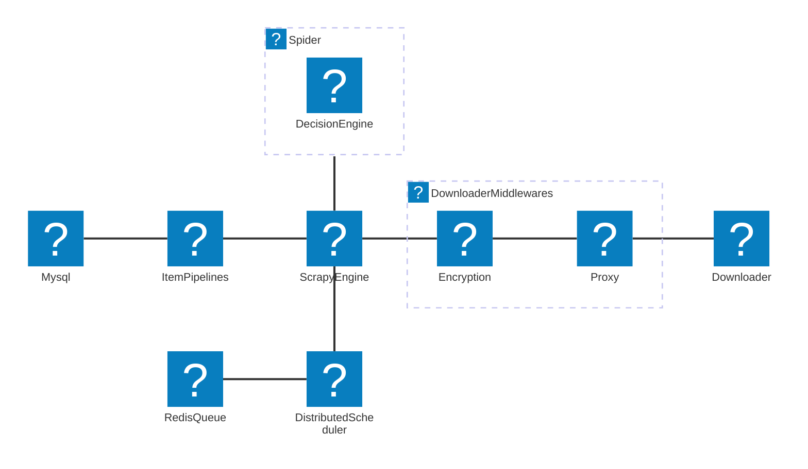

## Architecture

### Scrapy framework

### Integration

```mermaid
architecture-beta
group dm(logos:middleware)[DownloaderMiddlewares]
service encryption(logos:encryption)[Encryption] in dm
service proxy(logos:proxy)[Proxy] in dm

group spider(logos:spider)[Spider]
service de(logos:decision)[DecisionEngine] in spider

service engine(logos:scrapy)[ScrapyEngine]
service scheduler(logos:scheduler)[DistributedScheduler]
service item(logos:scrapy)[ItemPipelines]
service downloader(logos:scrapy)[Downloader]

engine:T -- B:de{group}
engine:R -- L:encryption
encryption:R -- L:proxy
downloader:L -- R:proxy
engine:B -- T:scheduler
engine:L -- R:item


service redis(logos:redis)[RedisQueue]

scheduler:L -- R:redis

service mysql(logos:mysql)[Mysql]

item:L -- R:mysql
```
